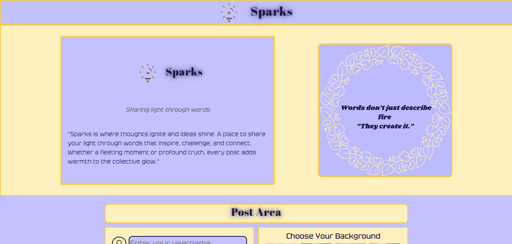

# ✨ Spark - Sharing light through words

**"Where Ideas Catch Fire"** 🔥

 <!-- Add your screenshot here -->

A vibrant web application that lets you create stunning social media posts with dynamic backgrounds and interactive features.

## Features

- 🎨 **Dynamic Backgrounds**: Set the mood with beautiful background selections
- 💬 **Engaging Comments**: Spark conversations with easy commenting
- ❤️ **Reactions**: Show love with our intuitive like system
- 🕒 **Timely**: Automatic timestamps keep everything current
- 👤 **Your Identity**: Post as yourself or remain anonymous

## Technologies

- **Frontend**: HTML5, CSS3, JavaScript
- **Frameworks**: [Bootstrap 5](https://getbootstrap.com/)
- **Icons**: [Font Awesome](https://fontawesome.com/)
- **Design**: Custom CSS with vibrant variables

